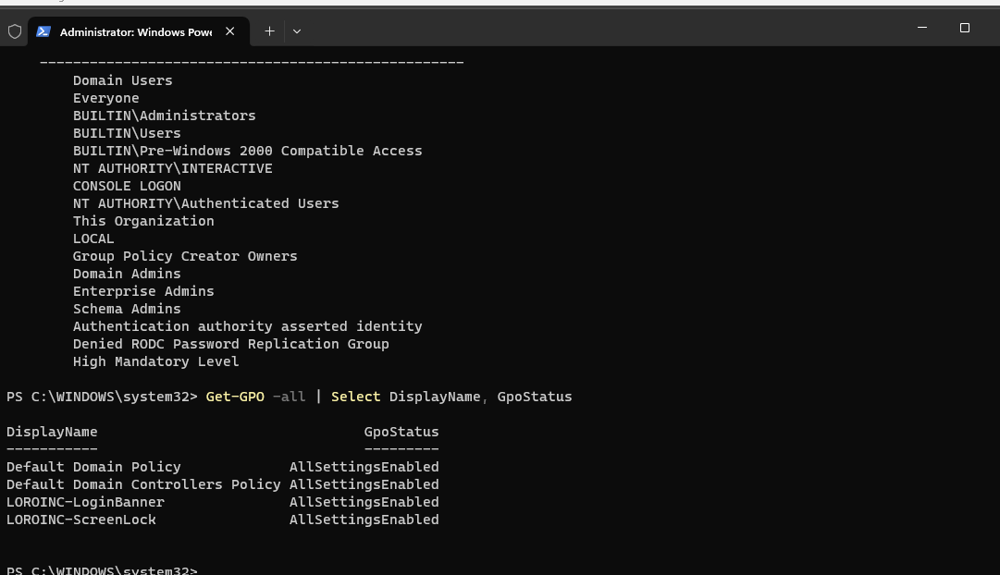
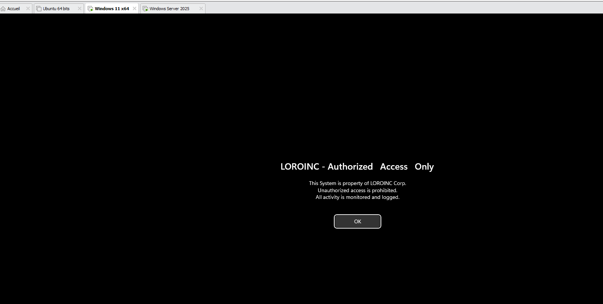
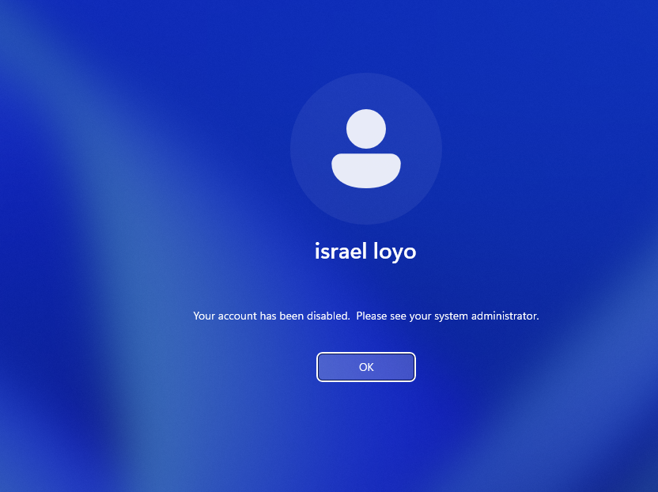

# Active-Directory-Home-Lab-# LOROINC Active Directory Home Lab

A complete Active Directory environment built from scratch in VMware — simulating a real corporate IT infrastructure for **LOROINC Corp**. This lab covers domain setup, user/group management, Group Policy enforcement, networking, file permissions, security monitoring, and remote support — the core daily tasks of an IT Support / Help Desk role.

---

## 🖥️ Lab Overview

| Component | Details |
|---|---|
| **Domain** | LOROINC.LOCAL |
| **Domain Controller** | LOROINC-DC01 (Windows Server 2022) |
| **Client** | WIN11-LORO (Windows 11) |
| **Hypervisor** | VMware Workstation |
| **Network** | NAT (192.168.100.0/24) |

### Network Diagram
```
                    ┌─────────────────────────┐
                    │   VMware NAT Network     │
                    │   192.168.100.0/24       │
                    │   Gateway: .2            │
                    └───────────┬──────────────┘
                                 │
            ┌────────────────────┴────────────────────┐
            │                                          │
   ┌────────▼─────────┐                    ┌──────────▼──────────┐
   │  LOROINC-DC01     │                    │   WIN11-LORO        │
   │  Windows Server   │◄──── Domain ──────►│   Windows 11        │
   │  2022             │       Join          │   (i.loyo)          │
   │  192.168.100.10   │                    │   DHCP/192.168.100.x│
   │                    │                    │                     │
   │  - AD DS / AD DC   │                    │   - Domain joined   │
   │  - DNS             │                    │   - GPOs applied    │
   │  - DHCP            │                    │   - RDP client      │
   │  - File Shares     │                    │                     │
   │  - GPO source      │                    │                     │
   └────────────────────┘                    └─────────────────────┘
```

---

## ✅ What I Configured

### Active Directory Domain Services
- [x] Promoted Windows Server 2022 to a Domain Controller (`Install-ADDSForest`)
- [x] Created new forest/domain: **LOROINC.LOCAL**
- [x] Verified domain health with `Get-ADDomain` and `Get-ADDomainController`

### Organizational Units, Users & Groups
- [x] Built OU structure: `_LOROINC` → IT, HR, Finance, Management, Computers, Service Accounts
- [x] Created 5 user accounts across departments
- [x] Created security groups: `GRP-IT-Admins`, `GRP-HR-Staff`, `GRP-Finance-Staff`, `GRP-All-Employees`
- [x] Practiced account lifecycle management: password resets, unlocks, disable/enable — via both ADUC and PowerShell

### DNS & DHCP
- [x] Verified AD-integrated DNS zone (`loroinc.local`)
- [x] Installed and configured DHCP role
- [x] Created scope `LOROINC-LAN` (192.168.100.50–200) and activated it

### Group Policy (GPOs)
- [x] Configured **Password Policy** on Default Domain Policy (12-char min, complexity enforced, lockout after 5 attempts)
- [x] Created and linked **LOROINC-ScreenLock** GPO (10-minute screen lock)
- [x] Created and linked **LOROINC-LoginBanner** GPO (custom security notice at logon)
- [x] Verified GPO application with `gpresult /r` and `gpupdate /force`

### Client Domain Join
- [x] Configured static DNS on Windows 11 client pointing to the DC
- [x] Joined Windows 11 to **LOROINC.LOCAL**
- [x] Logged in as a domain user (`LOROINC\i.loyo`)
- [x] **Troubleshot a real "sign-in method not allowed" error** caused by an empty "Allow log on locally" GPO setting — diagnosed and resolved through Group Policy Management

### File Shares & NTFS Permissions
- [x] Created department shared folders (`IT-Share`, `HR-Share`, `Finance-Share`, `Public-Share`)
- [x] Configured Share-level and NTFS-level permissions per department group
- [x] **Resolved permission inheritance issue** by disabling inheritance and converting to explicit permissions
- [x] Verified access control: IT user can access IT-Share, denied access to HR-Share

### Security Monitoring & Remote Support
- [x] Identified and filtered key Security Event IDs in Event Viewer (4624, 4625, 4720, 4740, 4756)
- [x] Triggered and investigated an account lockout (Event ID 4740)
- [x] Unlocked account via PowerShell (`Unlock-ADAccount`) and verified with `Get-ADUser`
- [x] Enabled Remote Desktop and connected from Windows 11 client to the Domain Controller

---

## 🔧 Key PowerShell Commands Used

```powershell
# Domain verification
Get-ADDomain
Get-ADDomainController

# User account management
Get-ADUser i.loyo -Properties *
Unlock-ADAccount -Identity i.loyo
Disable-ADAccount -Identity i.loyo
Enable-ADAccount -Identity i.loyo
Set-ADAccountPassword -Identity i.loyo -Reset -NewPassword (ConvertTo-SecureString "Pass@123!" -AsPlainText -Force)
Set-ADUser -Identity i.loyo -ChangePasswordAtLogon $true

# Check lockout status
Get-ADUser i.loyo -Properties LockedOut | Select Name, LockedOut

# Group management
Get-ADGroupMember GRP-IT-Admins
Add-ADGroupMember -Identity GRP-IT-Admins -Members i.loyo

# Group Policy
gpupdate /force
gpresult /r
Get-GPO -All | Select DisplayName, GpoStatus

# DNS verification
Resolve-DnsName loroinc.local
```

---

## 🛠️ Real Troubleshooting Encountered

This lab wasn't just following steps — these are real issues I diagnosed and fixed:

| Issue | Cause | Resolution |
|---|---|---|
| AD DS promotion froze the VM | Insufficient RAM allocated | Increased VM memory to 4–6GB, disabled real-time antivirus during install |
| Domain promotion via GUI unresponsive | Resource-heavy GUI wizard | Used `Install-ADDSForest` cmdlet instead — completed successfully in the background |
| Windows 11 "sign-in method not allowed" error | "Allow log on locally" GPO right was empty for domain users | Added `LOROINC\GRP-All-Employees` to the policy, forced `gpupdate`, restarted client |
| Couldn't remove "Users" group from NTFS permissions | Folder was inheriting permissions from parent | Disabled inheritance, converted to explicit permissions, then removed the group |
| RDP "Other user" login rejected | "Allow log on through Remote Desktop Services" right was missing | Reviewed and corrected User Rights Assignment in Default Domain Policy |

---

## 📸 Screenshots

### Domain Creation


### OU Structure


### Security Groups


### DHCP Scope


### Static IP Configuration


### GPO Status


### Login Banner GPO


### Domain Join — Windows 11


### NTFS Permissions — IT Share Access


### NTFS Permissions — Access Denied (HR Share)


### Account Lockout — Event Viewer


### Account Disabled


### Password Reset


### Remote Desktop — Connection Successful


### PowerShell Scripts Used


---

## 🎯 Why This Project Matters

This lab demonstrates hands-on, practical experience with the exact tasks performed daily in IT Support and Help Desk roles:

- User account creation, password resets, and account unlocks
- Group-based access control and file permission troubleshooting
- Group Policy creation, linking, and troubleshooting
- DNS/DHCP fundamentals
- Security event monitoring and incident response basics
- Remote support via RDP

Every component was built, broken, and fixed by hand — including real-world errors like GPO misconfigurations, permission inheritance issues, and resource constraints.

---

## 📫 Contact

**Israel Loyo**
🔗 [LinkedIn](https://linkedin.com/in/israelloyo) | 🐙 [GitHub](https://github.com/1221pentest-hash) | 📧 israel.loyo@aol.com
